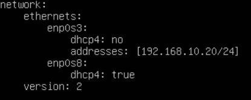

# Distributed-Log-Querier

We created a three-node cluster for this Project. We didn't have three physical machines available at home along with required networking Equipment etc. So, we decided to use VirtualBox. We created three Linux based (Ubuntu Server) virtual machines on VirtualBox, the cluster follows the master slave architecture, so one node acts as a master and the other two as slaves, any node in the cluster can act as a master, depends upon which node is Querying the system.

# Requirments

1. Virtual machines have their own network to communicate with each other.
2. Virtual machines are able to access internet.
3. Since where using Python3 for our program Python3 must be installed on the systems.
4. Host machine is able to establish shell connection with virtual machines.

# Process

We created three-node cluster. For simplicity, we kept the VM configuration same for all of the nodes i.e. 2 CPUs, 2 GB RAM and 8 GB Hard Disk.  

**Creating Network for our Cluster:**

First of all we create a small network for our cluster as we want to ensure all Virtual Machines in that cluster are able to talk to each other. 

- Open VirtualBox and click on File ⇒ Preferences ⇒ Network
- Click on “Add New NAT Network” icon
- Right Click on newly added NAT Network and edit the settings.
- Name your NAT Network to something meaningful. We named it "ClusterNetwork"
- Change the CIDR range per your needs. We used 192.168.1.0/24 range.
- “Supports DHCP” is checked by default. left it as it is.

After creating VMs, we specified a Network Interface so that we can meet our objectives.

- Opened the "Settings" of the selected virtual machine.
- Jumped to "Network" option in the left pane.
- In “Adapter 1” tab, ensured “Enable Network Adapter” is checked.
- Changed "Attached to" drop-down to "NAT Network". It automatically populate Name field with the NAT Network. In our case "ClusterNetwork". It also automatically define Adapter Type, MAC Address and other information.
- In “Adapter 2” tab, we ensured “Enable Network Adapter” is checked.
- Changed "Attached to" drop-down to "Bridged Adapter". You can use "Host Only Adapter" in case you do not want Internet Access but want to have access from your host computer.
- Click "OK" button

Repeated the above steps for other two nodes. Start VM and Install OS.

**Setup Static IP on each machine**:

We checked using the command "ifconfig" the IP address allocated to enp0s3 is "xxx.xxx.xxx.xxx", which is one of the IP address from our NAT Network range. This IP address is allocated dynamically by DCHP. We want to have Static IP Addresses, So:

- Master Node = 192.168.1.10
- Node 1 = 192.168.1.11
- Node 2 = 192.168.1.12

To assign each machine its own static ip address we underwent the following steps:

- Run the command, $ sudo nano /etc/netplan/50-cloud-init.yaml
- Modifed the "enp0s3" network interface under "ethernets" section as shown in the image.

- Save the file and run command: $ sudo netplan apply
- Now run "ifconfig" command again and notice IP address change.
- Run to open hosts file in editor: $ sudo nano /etc/hosts
- Ensure hosts file on all virtual machines have below entries:
- 192.168.1.10 linux-cluster-master
- 192.168.1.11 linux-cluster-node-01
- 192.168.1.12 linux-cluster-node-02

Now all that’s left is to open up an SSH connection between the nodes and then run grep command to query the distributed system logs, and all of this is done by our program “LogQuerier.py”.

**Working:**

- The program uses **netifaces** library to identify the ip of the current node running the program.
- Asks the user to select the node he/she want to run the query on, if the user select the current node to run the query the program responds by ignoring the establishment procedure of SSH connection and runs the query directly to the machine.
- Asks the user for regular expression/query, demands the character that acts as a parameter for **$ grep**.
- The program establishes an SSH connection between the nodes using **paramico** library in python.
- Runs the **$ grep** command via SSH connection.
- Returns the queried output.

 

|**Project By**|
|:--|
|Muhammad Hamza Fayyaz|
|Muhammad Abdullah Zahid|
